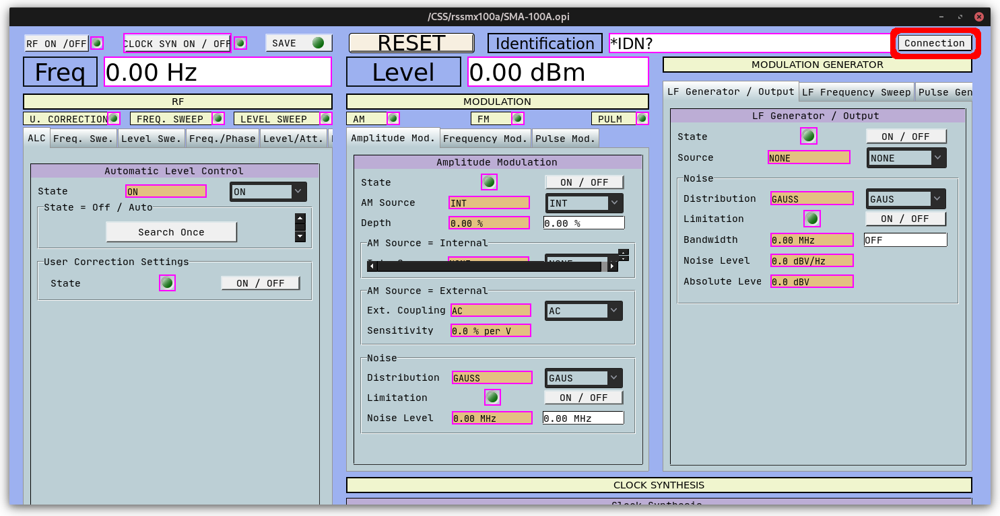
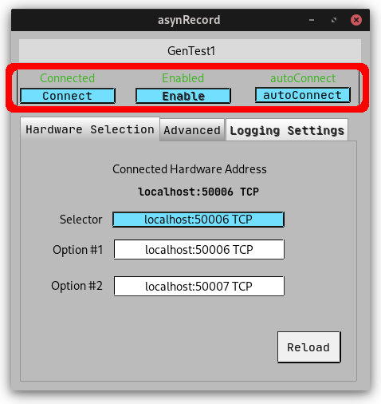
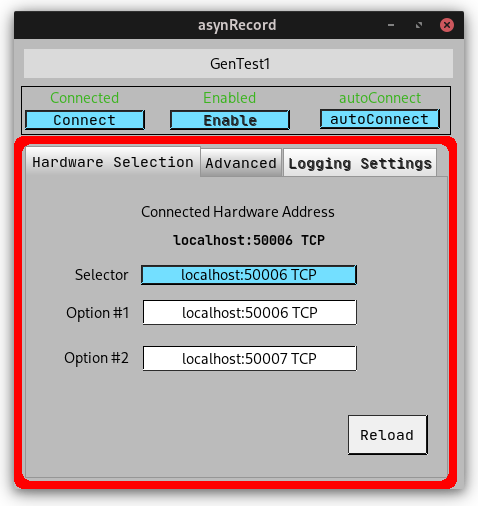
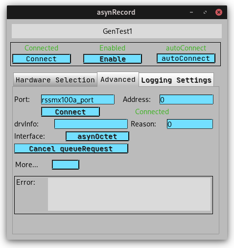

# rssmx100a-epics-ioc

EPICS IOC support for the R&S SMA100A and SMB100A signal generators. Some functionalities are exclusive to SMA100A.

## Documentation

The IOC documentation can be found in *documentation/*. There you can find a manual with the description off all SMX100A signal generator PVs.

## Building

To build the IOC, you can follow the standard EEPICS build procedure for IOC applications. The following EPICS modules are required:

- Asyn
- StreamDevice

The path to the required EPICS modules should be configured in the file configure/RELEASE, as the example below:

```
SUPPORT=/<path>/<to>/<synApps>
...
ASYN=$(SUPPORT)/<path to asyn>
CALC=$(SUPPORT)/<path to calc module>
AUTOSAVE=$(SUPPORT)/<path to autosave>

STREAM=<path to stream device>

EPICS_BASE=/<path>/<to>/<epics>/<base>
```

Afterwards, from the root repository directory, run 'make install'. At any time, if a rebuild is required, simply run the following commands:

```command
make clean uninstall install
```

## Initialization

For the IOC on this repository, the initialization can be done through
the following commands starting at the top level directory:

```sh
make clean uninstall install
cd iocBoot/iocrssmx100a
./runGenericSMX.sh -i IPADDR -p IPPORT -P PREFIX1 -R PREFIX2 -d DEVICE
```

- `-i IPADDR`: device IP address to connect to (required)
- `-p IPPORT`: device IP port number to connect to (default: 5025)
- `-d DEVICE`: device identifier (SMA|SMB) (required)
- `-P PREFIX`: the value of the EPICS `$(P)` macro used to prefix the PV names
- `-R PREFIX`: the value of the EPICS `$(R)` macro used to prefix the PV names

## Caput

An example of writing frequency is given below:

```
$ caput ${P}${R}:GENFreq-SP 1e8
```

## Caget

An example of reading frequency is given below:

```
$ caget ${P}${R}:GENFreq-RB
```

## RSSMX100A PV Structure

The PV's are divided in 7 major groups: GENERAL, FREQ, MOD,
TRIG, ROSC, CSYN and NOIS. To set values, use the given name. To read
them, add *\_RBV* after it.

- **GENERAL** - General functionalities

- **FREQ** - Functionalities related to FREQuency

- **MOD** - Functionalities related to MODulation

- **TRIG** - Functionalities related to TRIGgering

- **ROSC** - Functionalities related to Reference OSCillator

- **CSYN** - Functionalities related to Clock SYNthesis

- **NOIS** - Functionalities related to NOISe

The suffixes indicate the PV type and can be one of the following:

- SP (Set Point): A non-enumerated value (real number or string). It sets a system parameter.
- RB (Read Back): A non-enumerated value (real number or string). Read-only. It displays the read back value of a parameter, providing confirmation to changes.
- Sel (Selection): Enumerated value. Sets a system parameter.
- Sts (Status): Enumerated value. Read-only. It displays the read back value of an enumerated parameter, providing confirmation to changes.
- Cmd (Command): Binary command. It causes a given action to be executed.
- Mon (Monitor): Monitor non-enumerated or enumerated  device property variable

## IOC Structure

The IOC directory structure is the following:

- **configure** *(IOC configuration files)*
  - RELEASE *(It is necessary to edit the support modules' paths before building the IOC)*
  - ...
- **rssmx100aApp** *(Applications sources)*
  - **Db** *(The database files can be found here)*
    - SMA.db *(SMA Signal Generator records)*
    - SMB.db *(SMB Signal Generator records)*
    - rssma100a.proto *(Protocol file for SMA records used by Stream Device)*
    - rssmb100a.proto *(Protocol file for SMB records used by Stream Device)*
    - autosave_SMA.req *(SMA application autosave request file)*
    - autosave_SMB.req *(SMB application autosave request file)*
    - accessSecurityFile.acf *(Access security file)*
    - Makefile
  - **src** *(IOC source files)*
  - Makefile
- **documentation**
  - RSSMX100A_App_User_Guide.tex *(SMX LaTeX documentation source)*
- **iocBoot** *(Boot)*
  - **iocrssmx100a**
    - Makefile
    - **autosave** *(Save files are placed here by autosave)*
    - RSSMX100A.config *(RSSMX100A environment variables)*
    - README
    - runProcServ.sh *(Run runGenericCT.sh in procServ)*
    - save_restore.cmd *(Contain all autosave configurations)*
    - checkEnv.sh
    - parseCMDOpts.sh
    - runSMA.sh *(Run SMA PVs)*
    - runSMB.sh *(Run SMB PVs)*
    - runGenericSMX.sh *(Run SMA or SMB mode depending on the given -d option)*
    - stSMA.cmd *(SMA startup file)*
    - stSMB.cmd *(SMB startup file)*
  - Makefile
- Makefile *(IOC Makefile)*
- op *(Operator Interfaces)*
  - **opi**
    - Config_AM.opi
    - Config_AutomLevel-Control.opi
    - Config_ClockSyn.opi
    - Config_FM.opi
    - Config_Freq-Phase.opi
    - Config_Freq-Sweep.opi
    - Config_Level-Sweep.opi
    - Config_LF_FreqSweep.opi
    - Config_LF-Gen_Output.opi
    - Config_Lvl-Attenuator.opi
    - Config_PulM.opi
    - Config_PulseGen.opi
    - Config_ROSC.opi
    - Config_SMA.opi
- install *(Installation scripts)*
- scripts *(General scripts)*
- README.md *(This file)*

## Running the OPIs

The *op/opi*/ directory provide CSS OPIs for easily controlling the signal generator and applications process variables. In order to run the operator interfaces it is necessary to have Control System Studio installed. It is recommended to run `cs-studio` in the OPIs folder, in order to avoid having to reconfigure CS-Studio preferences.

## Hardware Replacement

The IOC supports hardware replacement by connecting the asyn port into another endpoint (SMA only).
The records defined at `./rssmx100aApp/Db/hotswap.db` impplement this behaviour.

| type | name                  | desc                              |
| ---- | --------------------- | --------------------------------- |
| asyn | $(P)$(R)              | asyn record for the specific port |
| mbbo | $(P)$(R)Hw-Sel        | hardware endpoints                |
| sub  | $(P)$(R)SubReload-Cmd | reload protocol @init             |

These values are persisted using autosave `./rssmx100aApp/Db/autosave_SMA.req` and the `$(P)$(R)Hw-Sel` record has it's PINI field enabled.

In oder to open the hardware connection interface click on the `Connection` button at the top right side of the screen.


On top to the tab panel there are 3 buttons *Connect*, *Enable* and *autoConnect*.

- **Connect** open and closes the IOC connection to the hardware.

- **Enable** button is not particulary usefull for the end-user, so it is disabled by default.

- **autoConnect** controls whether or not the IOC will automatically reconnect to the configured hardware address.



The *Hardware Selection* contains the current hardware as well as controls for changing it.

- **Selector** is a combobox that sets the HW address.
- **Option #n** contents of the combobox.
- **Reload** button that will reinitialize the protocol (ie. initialize records), should be selected after a hw change.



The user can check this tab for connection erros.



### Connect to another hardware
1. Open the asynRecod interface.
2. Select the correct ip address on the `Selector` combobox.
3. Click on the `Reload` button to reinitialize the database.

### Disconnect the IOC
The generator only supports a single connection. In order to disconnect the IOC:
1. Open the asynRecod interface.
2. Select `no autoConnect`
3. Select `disconnect`

